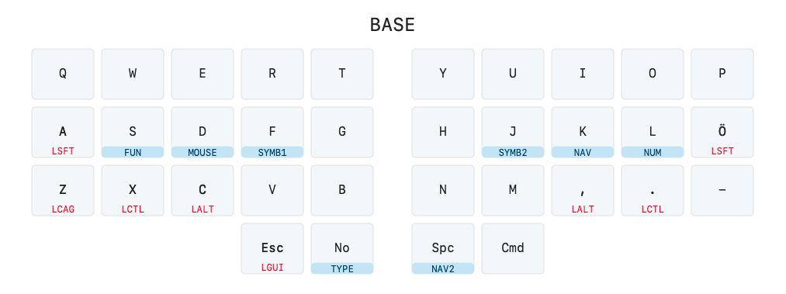

# Draw an svg image from your Ferris QMK keymap.c file

This script takes the keymap.c of a Ferris keyboard as an argument and parses it to generate the svg image. If you have any suggestions, please open a PR or an issue. Uses the drawing functions from [callum-oakley/keymap](https://github.com/callum-oakley/keymap).

**Ferris only.** Currently only tested with the layout of the [Ferris keyboard](https://github.com/davidphilipbarr/Sweep). I use the [Ben Vallack mod](https://github.com/benvallack/Ferris-Sweep-Tweaked) of the [Ferris Sweep](https://github.com/davidphilipbarr/Sweep) myself. The default settings (column stagger, thumb cluster offset etc.) matches the layout of the Ferris keyboard. It should also work with similar layouts (Corne, Kyria etc.), but you may need to adjust the settings.

## Usage

```
python3 main.py path/to/keymap.c
```

The `keymap.svg` file will be saved (or overwritten) in the same folder as `main.py`.

## Customizing labels, styles and settings

Duplicate the `labels_default.py`, `style_default.py` and `settings_default.py` files and rename them ro `labels_user.py`, `style_user.py` and `settings_user.py` respectively. Those files will then be used instead of the default ones. Make changes to the user files and run the script again.

## Demo image



## Known issues

-   Layer toggles only work for one definition per layer. Any repeated layer toggle definitions will overwrite the previous.
-   Thumb clusters can only have one row

## Todo

-   [ ] Show nested layer toggles on different layers.
-   [ ] Handle multiple toggles per layer
-   [ ] Show key combos
-   [ ] Add support for arbitrary keyboard layouts
-   [ ] Add support for rotating and positioning thumb cluster keys
