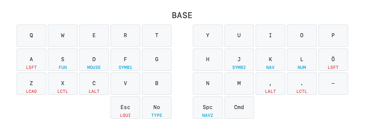

# Draw an svg image from your QMK keymap.c file
Derived from [callum-oakley/keymap](https://github.com/callum-oakley/keymap) this adaptation takes the keymap.c as an argument and parses it to generate the svg image. This is very much a work in progress. If you have any suggestions, please open a PR or an issue.

Currently only works with the layout of the [Ferris keyboard](https://github.com/davidphilipbarr/Sweep). I use the [Ben Vallack mod](https://github.com/benvallack/Ferris-Sweep-Tweaked) of the [Ferris Sweep](https://github.com/davidphilipbarr/Sweep) myself.

## Usage
```
python3 qmk-keymap-svg.py path/to/keymap.c
```
The `keymap.svg` file will be saves (or overwritten) in the same folder as `qmk-keymap-svg.py`. 

## Demo image


## Todo
- [X] Parse and show layer toggles
- [ ] Show held layer toggles on the correct layer
- [X] Find and parse custom keycodes
  - [ ] Find and parse custom keycodes in included heades files
- [X] Find and parse mod-tap and modifier keys
- [X] Show default layer keys
- [X] Make sure whitespace inside parentheses is ignored
- [ ] Add support for arbitrary keyboard layouts