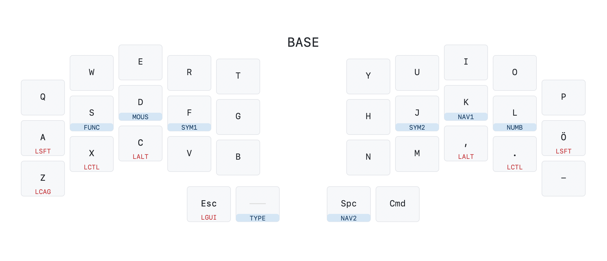

# Draw an svg image from your QMK keymap.c file
Derived from [callum-oakley/keymap](https://github.com/callum-oakley/keymap) this adaptation takes the keymap.c as an argument and parses it to generate the svg image. This is very much a work in progress. If you have any suggestions, please open a PR or an issue.

Currently only tested with the layout of the [Ferris keyboard](https://github.com/davidphilipbarr/Sweep). I use the [Ben Vallack mod](https://github.com/benvallack/Ferris-Sweep-Tweaked) of the [Ferris Sweep](https://github.com/davidphilipbarr/Sweep) myself. The default settings (column stagger, thumb cluster offset etc.) matches the layout of the Ferris keyboard.

## Usage
```
python3 qmk_keymap_svg.py path/to/keymap.c
```
The `keymap.svg` file will be saved (or overwritten) in the same folder as `qmk_keymap_svg.py`. 

## Customizing labels and settings
Duplicate the `labels_default.py` and `settings_default.py` files and rename them ro `labels_user.py` and `settings_user.py` respectively. Those files will then be used instead of the default ones. Make changes to the user files and run the script again.

## Demo image


## Known issues
- Layer toggles only work for one definition per layer. Any repeated layer toggle definitions will overwrite the previous.
- Thumb clusters can only have one row

## Todo
- [ ] Show nested layer toggles on different layers.
- [ ] Handle multiple toggles per layer
- [ ] Add support for arbitrary keyboard layouts